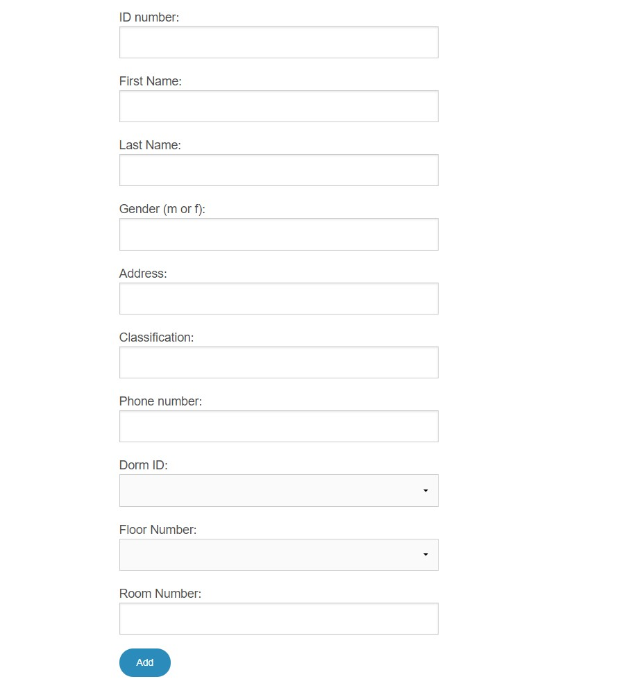
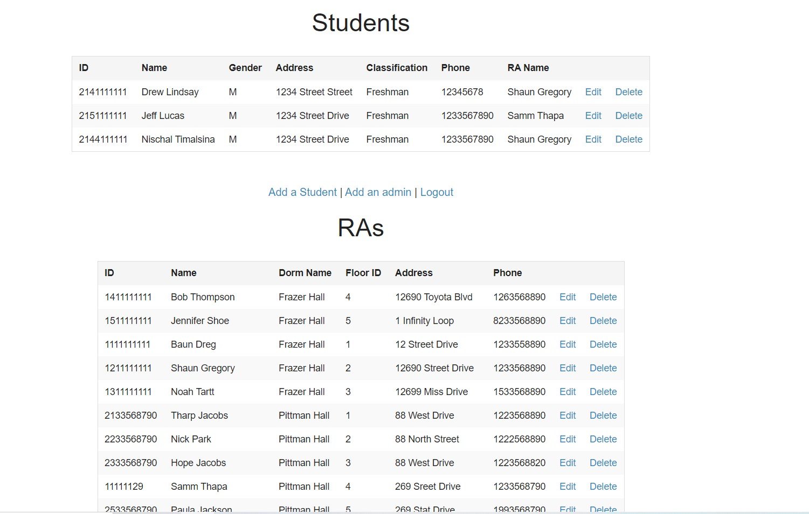
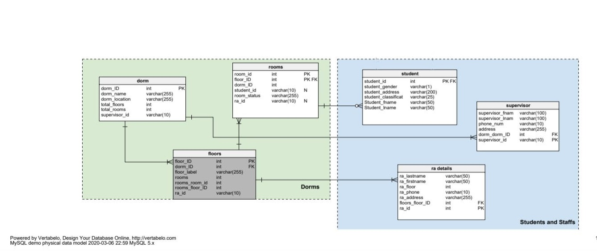

# StudentHousing-Database-Project
Student housing database project stores information about students living in dorms on campus. The database will hold data about the detailed information of students, RAs and supervisors like their id, name, address, phone number, room number, floor number, building name. In addition, the database allows the students to put in a request for their overnight guests. 

